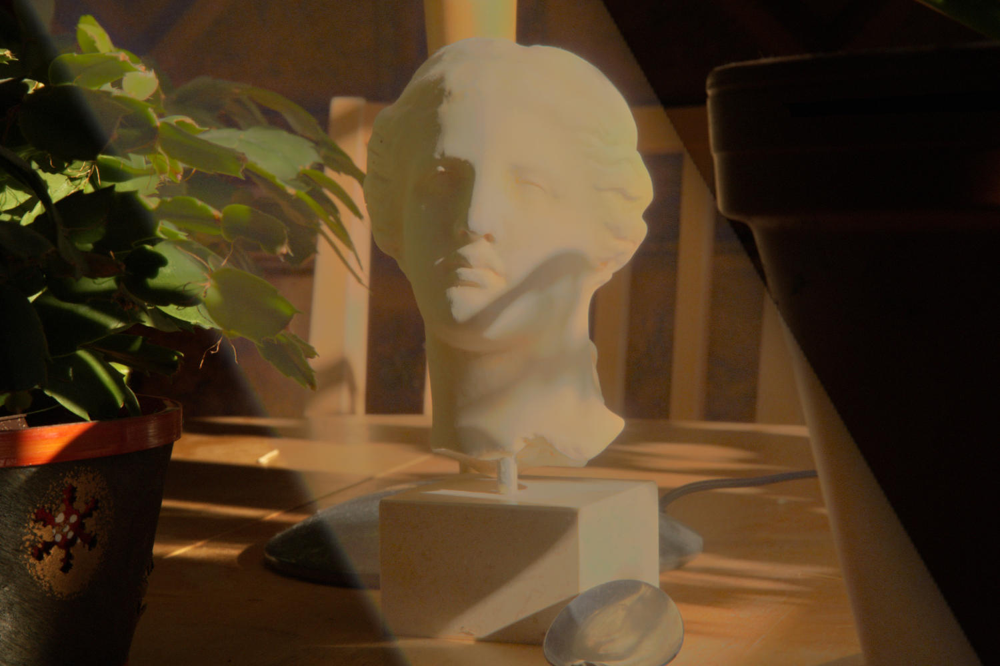
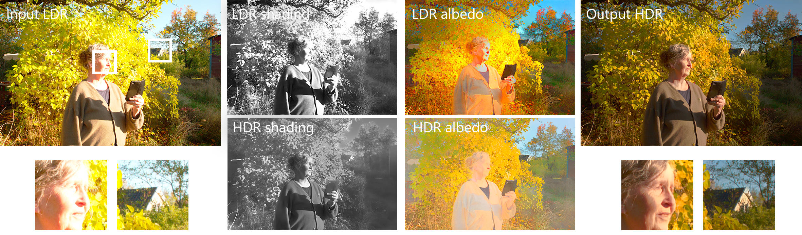

---

<div align="center">    
 
# Intrinsic Single-Image HDR Reconstruction  

[](https://yaksoy.github.io/intrinsicHDR/)
[](https://arxiv.org/abs/2409.13803)
[](https://www.youtube.com/watch?v=EiyH52BcKkw)
[](https://yaksoy.github.io/papers/ECCV24-IntrinsicHDR-supp.pdf)  


</div>
 


## Description   


The low dynamic range (LDR) of common cameras fails to capture the rich contrast in natural scenes, resulting in loss of color and details in saturated pixels. Reconstructing the high dynamic range (HDR) of luminance present in the scene from single LDR photographs is an important task with many applications in computational photography and realistic display of images. The HDR reconstruction task aims to infer the lost details using the context present in the scene, requiring neural networks to understand high-level geometric and illumination cues. This makes it challenging for data-driven algorithms to generate accurate and high-resolution results. 



In this work, we introduce a physically-inspired remodeling of the HDR reconstruction problem in the intrinsic domain. The intrinsic model allows us to train separate networks to extend the dynamic range in the shading domain and to recover lost color details in the albedo domain. We show that dividing the problem into two simpler sub-tasks improves performance in a wide variety of photographs.   



Try out our pipeline on your own images in Colab! [](https://colab.research.google.com/github/compphoto/intrinsicHDR/blob/main/notebooks/intrinsicHDR.ipynb)

## How to run   
First, install dependencies. The code was tested with Python 3.9.   
```bash
# clone project   
git clone https://github.com/compphoto/intrinsicHDR

# install project   
cd intrinsicHDR
pip install .
 ```   

The pipeline expects input images to be linear. 
To dequantize and linearize images, run:

 ```bash
# run linearization, e.g.  
python3 dequantize_and_linearize.py --test_imgs /path/to/input/imgs --output_path /path/to/results --root .
```
 Next, run our pipeline.  
 ```bash
# run module, e.g.  
python inference.py
```


### Citation
This implementation is provided for academic use only. Please cite our paper if you use this code or any of the models.   
```
@INPROCEEDINGS{dilleIntrinsicHDR,
author={Sebastian Dille and Chris Careaga and Ya\u{g}{\i}z Aksoy},
title={Intrinsic Single-Image HDR Reconstruction},
booktitle={Proc. ECCV},
year={2024},
} 
```   

### Credits
"./baselines/SingleHDR/" is adapted from [SingleHDR](https://github.com/alex04072000/SingleHDR) for their dequantization and linearization network.

".intrinsic_decomposition" is adapted from [IntrinsicImageDecomposition](https://github.com/compphoto/Intrinsic) for the decomposition network.

".src/midas/" is adapted from [MiDaS](https://github.com/intel-isl/MiDaS/tree/v2) for their EfficientNet implementation.
